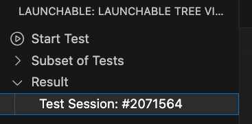

# Launchable extension for Visual Studio Code

An extension to use [Launchable](https://www.launchableinc.com/) features in Visual Studio Code. The extension provides a feature to get faster feedback about your change by only running tests that are worth running.

## Usage

After installing the extension, click the Launchable icon in the Activity Bar. Then, press the button `Start Test` in the view. You'll be asked to enter [API key](https://www.launchableinc.com/docs/sending-data-to-launchable/using-the-launchable-cli/getting-started/#creating-and-setting-your-api-key) and select the test runner.

After a while, the result will be appeared as follows. If you click it, you can check the result in Lauchable Web Console!

## Requirements

* [Launchable CLI](https://pypi.org/project/launchable/)
* [Python extension for Visual Studio Code](https://marketplace.visualstudio.com/items?itemName=ms-python.python)

## Supported test runners

* maven
* rspec
* go-test
* pytest
* file

## Extension Settings

* `launchable.testRunnerPath`: The path to the test runner
    * By default, the following paths are used:
        * maven: `mvn`
        * rspec: `bundle exec rspec`
        * go-test: `go test`
        * pytest: `[PYTHON PATH] -m pytest`
            * `[PYTHON PATH]` is configured by `Python: Select Interpreter` command.
* `launchable.testCasePath`: The path to the full list of tests. It can be the glob expression such as `test/**/*.rb`
    * By default, the following paths are used:
        * maven: `src/test/java`
        * rspec: `spec/**/*_spec.rb`
* `launchable.testListCommand`: The command to output the full list of tests, e.g. find ./test -name '*.js'.
    * By default, the following commands are used:
        * go-test: `go test -list . ./...`
        * pytest: `[PYTHON PATH] -m pytest --collect-only -q`
            * `[PYTHON PATH]` is configured by `Python: Select Interpreter` command.
* `launchable.subsetPath`: The path to the file that is a subset of tests
* `launchable.testReportPath` The path to your test report files, e.g. ./reports/*.xml
    * By default, the following paths are used:
        * maven: target/surefire-reports/*.xml
* `launchable.testRunCommand`: The command to run tests
    * By default, the following commands are used:
        * maven: `mvn test -Dsurefire.includesFile=[SUBSET FILE]`
        * rspec: `bundle exec rspec $(cat [SUBSET FILE]) --format d --format RspecJunitFormatter --out [TEST REPORT PATH]`
        * go-test: `go test -run $(cat [SUBSET FILE]) ./... -v 2>&1 | go-junit-report > [TEST REPORT PATH]`
        * pytest: `[PYTHON PATH] -m pytest --junit-xml=[TEST REPORT PATH] $(cat [SUBSET FILE])`
            * `[PYTHON PATH]` is configured by `Python: Select Interpreter` command.

You can configure a subset optimization target in the following fields. If you want to know the concept, please read https://www.launchableinc.com/docs/features/predictive-test-selection/requesting-and-running-a-subset-of-tests/choosing-a-subset-optimization-target/.

* `launchable.optimizationTarget.confidence`: Confidence target
* `launchable.optimizationTarget.fixedTime`: Fixed time target
* `launchable.optimizationTarget.percentageTime`: Percentage time taget
    * `percentageTime` field is configured as "80%" in the default.
