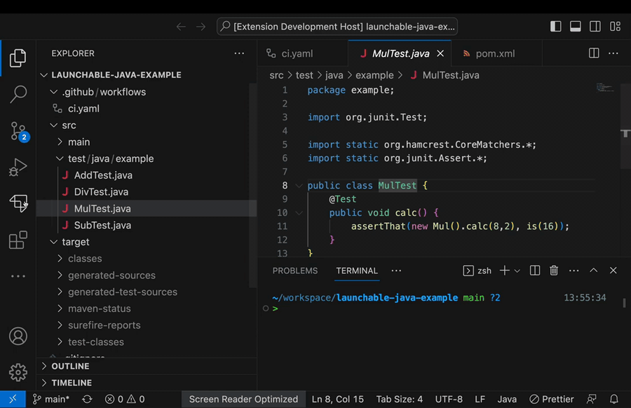

# Launchable extension for Visual Studio Code

An extension to use [Launchable](https://www.launchableinc.com/) features in Visual Studio Code. The extension provides a feature to get faster feedback about your change by only running tests that are worth running.

## Requirements

* [Launchable CLI](https://pypi.org/project/launchable/)
* [Python extension for Visual Studio Code](https://marketplace.visualstudio.com/items?itemName=ms-python.python)

## Supported test runners

* maven
* rspec
* go-test
* pytest

## Extension Settings

* `launchable.testRunnerPath`: The path to the test runner
* `launchable.testCasePath`: The path to the full list of tests. It can be the glob expression such as `test/**/*.rb`
* `launchable.testListCommand`: The command to output the full list of tests, e.g. find ./test -name '*.js'.